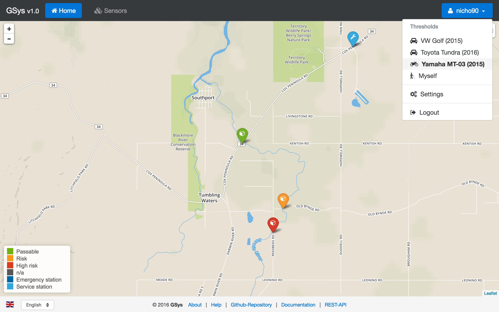
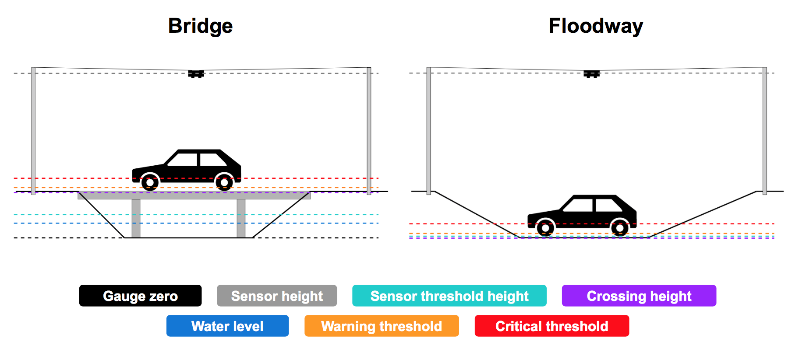

# Geospatial Web of Things - Virtual Smart Things Approach

[![license][licence-img]][licence-url]

[licence-img]:https://img.shields.io/badge/licence-MIT-blue.svg?style=flat-square
[licence-url]:https://opensource.org/licenses/MIT

This project is part of the course *The Geospatial Web of Things*, which took place at the [Institute for Geoinformatics, Münster](http://www.uni-muenster.de/Geoinformatics/en/) in summer term 2016. 3 groups implemented different use-cases in different architectures (Vertical Integration, Virtual Smart Things, Physical Smart Things). This repository contains the work of the group with the **Virtual Smart Things** architecture. 

Within this study project we implemented smart and mobile water gauges as first class citizens in the Web of Things. We distinguished between IoT and WoT concepts, technologies and application patterns, and we learned to develop and integrated smart things into the socio technical environment of disaster management.

### Demo

* Link: [http://giv-gwot-vst.uni-muenster.de](http://giv-gwot-vst.uni-muenster.de)
* Username: `demo`
* Password: `demo2016`

***

### Architecture

***

### Contributors

:octocat: [Rehan Aziz Chaudhary](https://github.com/rehans516) 
:octocat: [Timm Kühnel](https://github.com/timmimim) 
:octocat: [Heinrich Löwen](https://github.com/heinrichloewen) 
:octocat: [Nicholas Schiestel](https://github.com/nicho90) 

***

### Related repository

* **Virtual Smart Things Documentation**: [https://github.com/nicho90/GWoT-VST-Docs](https://github.com/nicho90/GWoT-VST-Docs)
* Vertical Integration: [https://github.com/mrunde/WoT-Vertical-Approach](https://github.com/mrunde/WoT-Vertical-Approach)
* Physical Smart Things: [https://github.com/JanVan01/gwot-physical](https://github.com/JanVan01/gwot-physical)
